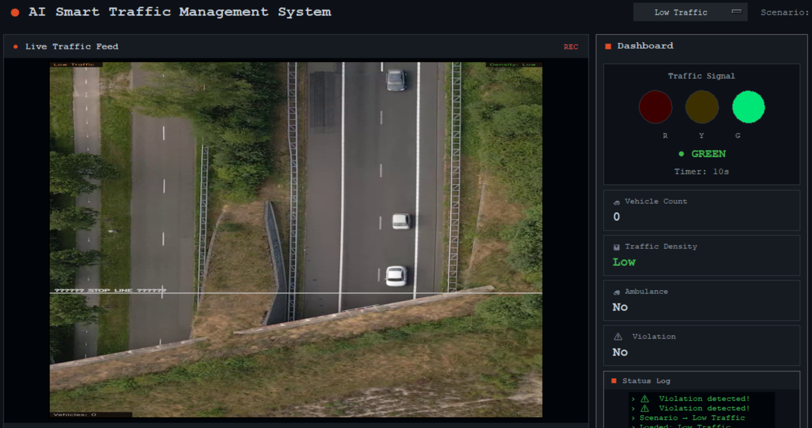
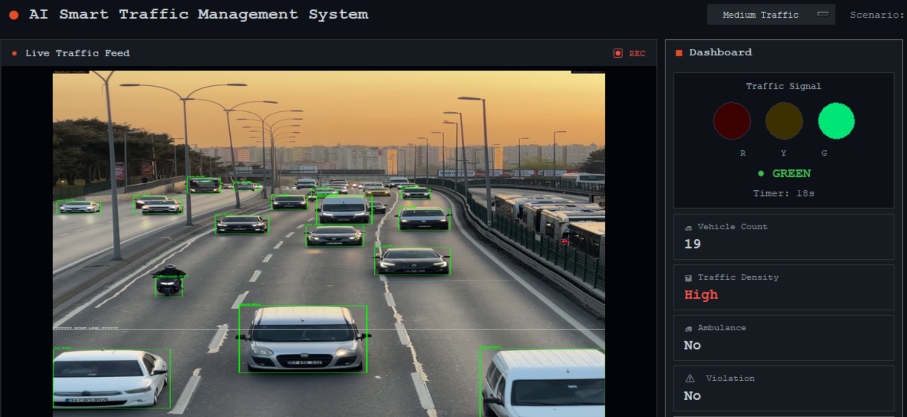
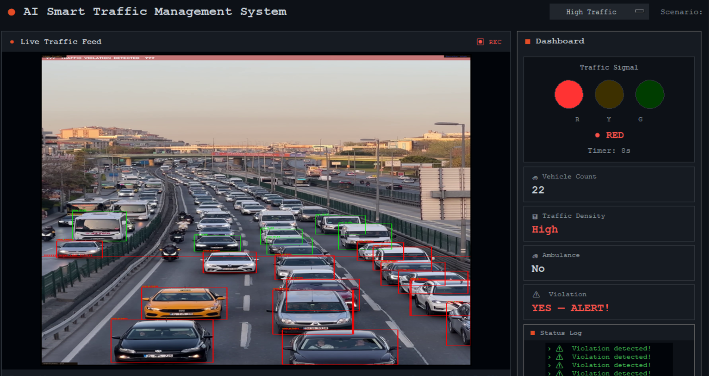
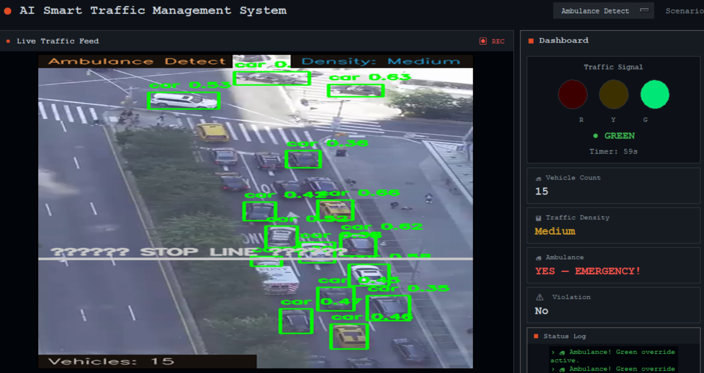

# 🚦 AI-Based Smart Traffic Management System

An AI-powered Smart Traffic Management System developed using **Python, YOLOv8, OpenCV, and Tkinter**. The system performs real-time vehicle detection, traffic density analysis, adaptive traffic signal control, emergency vehicle prioritization, and traffic violation detection using computer vision.

---

## 📸 Project Screenshots

### 🚦 Low Traffic Detection



---

### 🚗 Medium Traffic Detection



---

### 🚙 High Traffic Detection



---

### 🚑 Ambulance Detection



---

## ✨ Features

- 🚗 Real-time vehicle detection using YOLOv8
- 📊 Vehicle counting and traffic density analysis
- 🚦 Adaptive traffic signal control based on traffic density
- 🚑 Emergency vehicle priority
- 🚫 Traffic signal violation detection
- 🖥️ Interactive Tkinter dashboard
- 📹 Supports multiple traffic scenarios using prerecorded videos

---

## 🛠️ Technologies Used

- Python
- YOLOv8 (Ultralytics)
- OpenCV
- Tkinter
- NumPy
- Pillow

---

## 📂 Project Structure

```text
AI-Smart-Traffic-Management-System/
│
├── screenshots/
│   ├── low_traffic.png
│   ├── medium_traffic.png
│   ├── high_traffic.png
│   └── ambulance_detect.png
│
├── videos/
│
├── main.py
├── gui.py
├── config.py
├── vehicle_counter.py
├── signal_logic.py
├── ambulance_detection.py
├── violation_detection.py
├── requirements.txt
├── yolov8n.pt
└── README.md
```

---

## ▶️ How to Run

Install the required libraries:

```bash
pip install -r requirements.txt
```

Run the application:

```bash
python main.py
```

---

## 🚀 Future Enhancements

- Multi-lane traffic management
- Automatic Number Plate Recognition (ANPR)
- Live CCTV camera integration
- Cloud-based traffic monitoring
- Web-based dashboard
- Traffic analytics and reporting

---

## 👩‍💻 Author

**Anithaa Shree**

- GitHub: https://github.com/AnithaaShree
- LinkedIn: https://www.linkedin.com/in/anithaa-shree-527472340/
